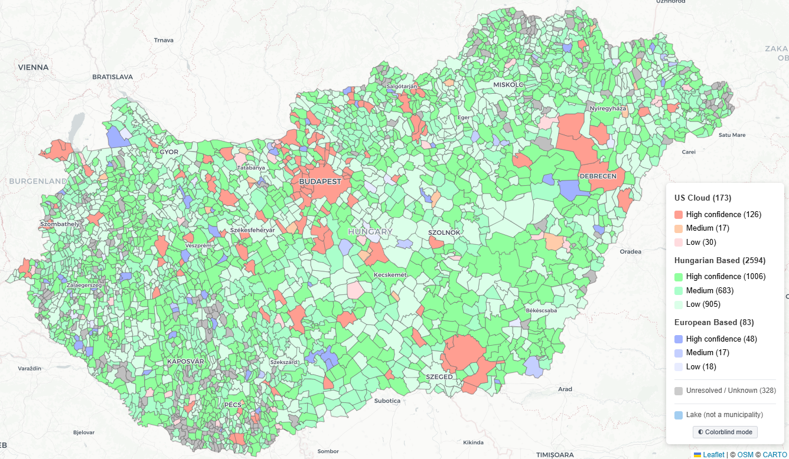
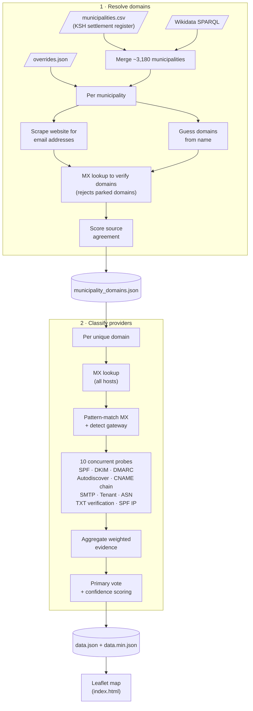

# MXmap — Email Providers of Hungarian Municipalities

[](https://github.com/complexity-science-hub/mxmap-hu/actions/workflows/ci.yml)

Interactive map showing where Hungary's ~3,180 municipalities host their official email and how deeply their DNS is tied to US hyperscalers (Microsoft, Google, AWS) versus Hungarian providers, other European providers, and self-hosted mail servers. This is the Hungarian fork of [MXmap](https://github.com/davidhuser/mxmap).

**[View the live map](https://complexity-science-hub.github.io/mxmap-hu/)**

[](https://complexity-science-hub.github.io/mxmap-hu/)

## How it works

The data pipeline has two stages:

1. **Resolve domains** — Merges all ~3,180 Hungarian municipalities from a local KSH (Hungarian Central Statistical Office) settlement register (`data/municipalities.csv`) and Wikidata, applies manual overrides, scrapes municipal websites for email addresses, guesses domains from municipality names, and verifies candidates with MX lookups. Scores source agreement to pick the best domain. Outputs `municipality_domains.json`.

2. **Classify providers** — For each resolved domain, looks up all MX hosts, pattern-matches them, then runs 10 concurrent probes (SPF, DKIM, DMARC, Autodiscover, CNAME chain, SMTP banner, Tenant, ASN, TXT verification, SPF IP). Aggregates weighted evidence, computes confidence scores (0–100). Outputs `data.json` (full) and `data.min.json` (minified for the frontend).



## Classification system

see [`classifier.py`](src/mail_sovereignty/classifier.py) for the full implementation details, but in summary,
we use a weighted evidence system where each probe contributes signals of varying strength towards different provider classifications.

### Known limitations

#### Budapest districts

Budapest's 23 districts ("Budapest 01. ker." – "Budapest 23. ker.") each have their own
municipal government and are individually classified in `data.json`, in addition to a
whole-city entry (`budapest.hu`). However, the map's TopoJSON source (Eurostat GISCO LAU,
`data/LAU_HU_01M_2024_3035.topo.json`) models Budapest as a single polygon, so the 23
district classifications have no matching polygon and never render individually on the
map. They are still included, unfiltered, in the aggregate summary statistics — both the
Python pipeline's counts/category totals (`pipeline.py`) and the frontend legend counts
(`index.html`). Keep this in mind when interpreting aggregate percentages: Budapest is
effectively represented up to 24 times in the totals but only once visually on the map.

#### Web domain ≠ actual mail usage

The pipeline classifies where the MX of a municipality's *website* domain points — not
where its staff actually receive mail. Small Hungarian villages very commonly use
`freemail.hu` / `gmail.com` / `t-online.hu` mailboxes as their real, day-to-day contact
address, and `SKIP_DOMAINS` (`constants.py`) deliberately filters these out during
scraping, since they're personal-style webmail providers, not the municipality's own
infrastructure. The practical effect: a village whose hosting package ships a default,
never-used MX record gets counted as "hungarian-based," while genuine freemail/Gmail
dependence for actual mail traffic is invisible to this classifier entirely. This tends to
inflate the Hungarian-based share for micro-villages. This limitation is shared by the
whole MXmap family.

### Other known caveats

- **Editorial categorization calls**: `t-online` is categorized as `hungarian-based`
  even though Magyar Telekom is majority-owned by Deutsche Telekom, and any
  self-hosted (`independent`) mail server is assumed domestic even though it could be
  running on a non-Hungarian VPS. See the comment above `_CATEGORY_MAP` in
  `pipeline.py`.
- **`shared_domain` is exact-match only**: it flags municipalities that resolved to
  the literal same domain string, so it will not catch joint municipal offices (közös
  önkormányzati hivatal — roughly 1,200 of them nationally) that share mail
  infrastructure under different per-village domains. See `_add_shared_domain_flags`
  in `resolve.py`.
- **The `unresolved` category name is misleading**: it does not mean DNS/MX
  resolution failed. It means the domain has a working MX record, but nothing
  matched a known provider signature and it didn't look Hungarian-hosted either. See
  the comment on `Provider.UNRESOLVED` in `models.py`.


## Quick start

```bash
uv sync

# Stage 1: resolve municipality domains
uv run resolve-domains

# Stage 2: classify email providers
uv run classify-providers

# Serve the map locally
python -m http.server
```

## Development

```bash
uv sync --group dev

# Run tests (90% coverage threshold enforced)
uv run pytest --cov --cov-report=term-missing

# Lint & format
uv run ruff check src tests
uv run ruff format src tests
```


## Related work

* [hpr4379 :: Mapping Municipalities' Digital Dependencies](https://hackerpublicradio.org/eps/hpr4379/index.html)
* If you know of other similar projects, please open an issue or submit a PR to add them here!

## Forks

Country-specific forks, alphabetical by country code:

* **BE** — https://mxmap.be/
* **DE** — https://b42labs.github.io/mxmap/ · https://mx-map.de/
* **EU** — https://livenson.github.io/mxmap/
* **FR** — https://mxmairies.fr/
* **LV** — https://securit.lv/mxmap
* **NL** — https://mxmap.nl/
* **NO** — https://kommune-epost-norge.netlify.app/
* **PT** — https://mxmap.pt/
* **SE** — https://swedish-mail-dependency.netlify.app/
* **UK** — https://mxmap.uk/

Related projects:

* [CAmap Nordic & Baltic](https://koldex.github.io/ca-sovereignty-map/) — TLS CA sovereignty for Nordic and Baltic municipalities ([source](https://github.com/koldex/ca-sovereignty-map))

See also the [forks of this repository](https://github.com/davidhuser/mxmap/network/members).


## Contributing

If you spot a misclassification, please open an issue with the KSH code (municipality ID) and the correct provider.
For municipalities where automated detection fails, corrections can be added to [`overrides.json`](data/overrides.json).

## Licence

[MIT](LICENCE)
